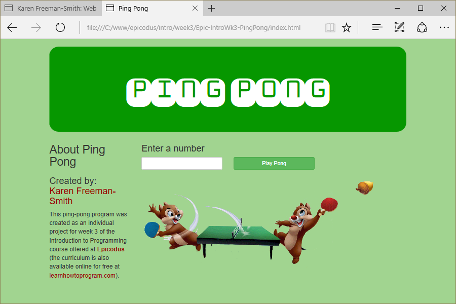

# Ping Pong
Version 0.2.0: August 19, 2016
by [Karen Freeman-Smith](https://karenfreemansmith.github.io)

### Technologies Used
HTML, CSS, Bootstrap, JavaScript, jQuery

## Description
*[Epicodus](http://epicodus.com) Intro to Programming Week 3 Final Individual Project: Build a ping-pong website.*

## Setup/Installation
* [View on Github Pages](https://karenfreemansmith.github.io/Epic-IntroWk3-PingPong)
* _OR_
* Clone directory
* Open index.html in your favorite browser

## Support & Contact
For questions, concerns, or suggestions please email karenfreemansmith@gmail.com

## Specifications
* Displays numbers from 1 to the user's number
  * Example Input: 2
  * Example Output: [1,2]
* Numbers that are divisible by 3 are replaced with "ping"
  * Example Input: 3
  * Example Output: [1,2,ping]
* Numbers that are divisible by 5 are replaced with "pong"
  * Example Input: 5
  * Example Output: [1,2,ping,4,pong]
* Numbers that are divisible by 15 are replaced with "ping-pong"
  * Example Input: 15
  * Example Output:[1,2,ping,4,pong,ping,7,8,ping,pong,11,ping,13,14,ping-pong]
* Additional Features:
  * Style page with columns and "about" section
  * Add ping pong sounds for ping, pong, ping-pong, and miss
  * Add animation for each submission

## Known Issues
* Animation only works on first "play" until the page is refreshed.
* Attempts to time sound to animation failed.

## Legal
*Licensed under the GNU General Public License v3.0*

Copyright (c) 2016 Copyright _[Karen Freeman-Smith](https://karenfreemansmith.github.io)_ All Rights Reserved.
